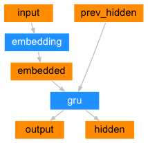

# Sequence to Sequence and Attention


## The Seq2Seq Model

A Sequence to Sequence (seq2seq) network, or Encoder Decoder network, is a model consisting of two RNNs called the encoder and decoder. The encoder reads an input sequence and outputs a single vector, and the decoder reads that vector to produce an output sequence.


Unlike sequence prediction with a single RNN, where every input corresponds to an output, the seq2seq model frees us from sequence length and order, which makes it ideal for translation between two languages.


### The Encoder

The encoder of a seq2seq network is a RNN that outputs some value for every word from the input sentence. For every input word the encoder outputs a vector and a hidden state, and uses the hidden state for the next input word.



```python
class EncoderRNN(nn.Module):
    def __init__(self, input_size, hidden_size):
        super(EncoderRNN, self).__init__()
        self.hidden_size = hidden_size

        self.embedding = nn.Embedding(input_size, hidden_size)
        self.gru = nn.GRU(hidden_size, hidden_size)

    def forward(self, input, hidden):
        embedded = self.embedding(input).view(1, 1, -1)
        output = embedded
        output, hidden = self.gru(output, hidden)
        return output, hidden

    def initHidden(self):
        return torch.zeros(1, 1, self.hidden_size, device=device)
```

### The Decoder

The decoder is another RNN that takes the encoder output vector(s) and outputs a sequence of words to create the translation.

#### Simple Decoder

In the simplest seq2seq decoder we use only last output of the encoder. At every step of decoding, the decoder is given an input token and hidden state. The initial input token is the start-of-string `<SOS>` token, and the first hidden state is the context vector (the encoder’s last hidden state).


```python
class DecoderRNN(nn.Module):
    def __init__(self, hidden_size, output_size):
        super(DecoderRNN, self).__init__()
        self.hidden_size = hidden_size

        self.embedding = nn.Embedding(output_size, hidden_size)
        self.gru = nn.GRU(hidden_size, hidden_size)
        self.out = nn.Linear(hidden_size, output_size)
        self.softmax = nn.LogSoftmax(dim=1)

    def forward(self, input, hidden):
        output = self.embedding(input).view(1, 1, -1)
        output = F.relu(output)
        output, hidden = self.gru(output, hidden)
        output = self.softmax(self.out(output[0]))
        return output, hidden

    def initHidden(self):
        return torch.zeros(1, 1, self.hidden_size, device=device)
```

If only the context vector is passed betweeen the encoder and decoder, that single vector carries the burden of encoding the entire sentence.

#### Attention Decoder

Attention allows the decoder network to “focus” on a different part of the encoder’s outputs for every step of the decoder’s own outputs. 

First we calculate a set of **attention weights**. These will be multiplied by the encoder output vectors to create a weighted combination. The result (called `attn_applied` in the code) should contain information about that specific part of the input sequence, and thus help the decoder choose the right output words.


Calculating the attention weights is done with another feed-forward layer `attn`, using the decoder’s input and hidden state as inputs. 

Because there are sentences of all sizes in the training data, to actually create and train this layer we have to choose a maximum sentence length (input length, for encoder outputs) that it can apply to. Sentences of the maximum length will use all the attention weights, while shorter sentences will only use the first few.


```python
class AttnDecoderRNN(nn.Module):
    def __init__(self, hidden_size, output_size, dropout_p=0.1, max_length=MAX_LENGTH):
        super(AttnDecoderRNN, self).__init__()
        self.hidden_size = hidden_size
        self.output_size = output_size
        self.dropout_p = dropout_p
        self.max_length = max_length

        self.embedding = nn.Embedding(self.output_size, self.hidden_size)
        self.attn = nn.Linear(self.hidden_size * 2, self.max_length)
        self.attn_combine = nn.Linear(self.hidden_size * 2, self.hidden_size)
        self.dropout = nn.Dropout(self.dropout_p)
        self.gru = nn.GRU(self.hidden_size, self.hidden_size)
        self.out = nn.Linear(self.hidden_size, self.output_size)

    def forward(self, input, hidden, encoder_outputs):
        embedded = self.embedding(input).view(1, 1, -1)
        embedded = self.dropout(embedded)

        attn_weights = F.softmax(
            self.attn(torch.cat((embedded[0], hidden[0]), 1)), dim=1)
        attn_applied = torch.bmm(attn_weights.unsqueeze(0),
                                 encoder_outputs.unsqueeze(0))

        output = torch.cat((embedded[0], attn_applied[0]), 1)
        output = self.attn_combine(output).unsqueeze(0)

        output = F.relu(output)
        output, hidden = self.gru(output, hidden)

        output = F.log_softmax(self.out(output[0]), dim=1)
        return output, hidden, attn_weights

    def initHidden(self):
        return torch.zeros(1, 1, self.hidden_size, device=device)
```

> More detail: [Translation with a Sequence to Sequence Network and Attention](https://pytorch.org/tutorials/intermediate/seq2seq_translation_tutorial.html) 


### Training

To train, for each pair we will need an input tensor and target tensor. For example, to train we run the input sentence through the encoder, and keep track of every output and the latest hidden state. Then the decoder is given the `<SOS>` token as its first input, and the last hidden state of the encoder as its first hidden state.

“Teacher forcing” is the concept of using the real target outputs as each next input, instead of using the decoder’s guess as the next input. Using teacher forcing causes it to converge faster but when the trained network is exploited, it may exhibit instability.

* Teacher forcing: Feed the target as the next input
* Without teacher forcing: use its own predictions as the next input


### Evaluation

Evaluation is mostly the same as training, but there are no targets so we simply feed the decoder’s predictions back to itself for each step. Every time it predicts a word we add it to the output string, and if it predicts the EOS token we stop there. 


## How to build model

More details to build the following models: [here](./examples)

* Neural Machine Translation by Jointly Learning to Align and Translate
* Effective Approaches to Attention-based Neural Machine Translation
* Scheduled Sampling for Sequence Prediction with Recurrent Neural Networks
* Building End-To-End Dialogue Systems Using Generative Hierarchical Neural Network Models
* Attention is all you need


## More models

* [IBM/pytorch-seq2seq](https://github.com/IBM/pytorch-seq2seq)

* [MaximumEntropy/Seq2Seq-PyTorch](https://github.com/MaximumEntropy/Seq2Seq-PyTorch)

* [eladhoffer/seq2seq.pytorch](https://github.com/eladhoffer/seq2seq.pytorch)

* [Modeling Long- and Short-Term Temporal Patterns with Deep Neural Networks](https://arxiv.org/pdf/1703.07015.pdf), Source code: [https://github.com/laiguokun/LSTNet](https://github.com/laiguokun/LSTNet)

* [Hierarchical Multiscale Recurrent Neural Networks](https://arxiv.org/pdf/1609.01704.pdf), Source code: [https://github.com/n-s-f/hierarchical-rnn](https://github.com/n-s-f/hierarchical-rnn)

* [Independently Recurrent Neural Network (IndRNN): Building A Longer and Deeper RNN](https://arxiv.org/pdf/1803.04831.pdf), Source code: [https://github.com/batzner/indrnn](https://github.com/batzner/indrnn)

* [Deep Speech 2: End-to-End Speech Recognition in English and Mandarin](https://arxiv.org/pdf/1512.02595v1.pdf), Source code: [https://github.com/SeanNaren/deepspeech.pytorch](https://github.com/SeanNaren/deepspeech.pytorch)

* [Twin Networks: Matching the Future for Sequence Generation](https://arxiv.org/abs/1708.06742), Source code: [https://github.com/dmitriy-serdyuk/twin-net/](https://github.com/dmitriy-serdyuk/twin-net/)

* [Segmental Recurrent Neural Networks](https://arxiv.org/pdf/1511.06018.pdf), Source code: [https://github.com/zhan-xiong/segrnn](https://github.com/zhan-xiong/segrnn)

* [Listen, Attend and Spell](https://arxiv.org/pdf/1508.01211v2.pdf), Source code: [https://github.com/XenderLiu/Listen-Attend-and-Spell-Pytorch](https://github.com/XenderLiu/Listen-Attend-and-Spell-Pytorch)
